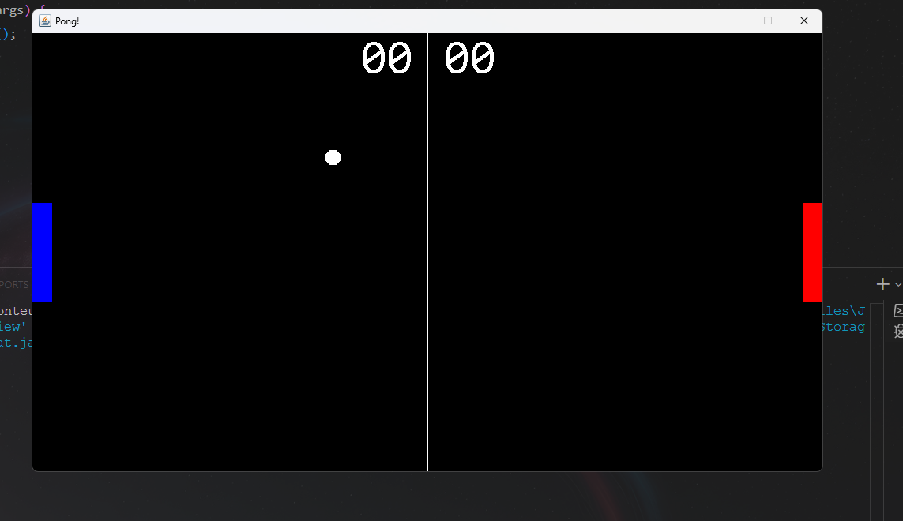

# 🏓 Pong Game em Java

Um remake clássico do jogo **Pong** desenvolvido em Java com programação orientada a objetos. Totalmente funcional com sistema de placar, colisão, movimentação suave e interface gráfica usando `Swing`.

<p align="center">
  
</p>

---

## 🚀 Funcionalidades

- 🎮 Controles responsivos para dois jogadores
- 💥 Detecção de colisão precisa entre bola e raquetes
- 🔢 Sistema de pontuação individual para cada jogador
- 🖼️ Interface gráfica usando `JFrame` e `JPanel`
- 🧩 Arquitetura modular com separação clara de responsabilidades
- 🔄 Loop de jogo contínuo e fluido com `Thread`

---

## 🧠 Habilidades Utilizadas

✅ **Programação Orientada a Objetos (POO)**  
✅ **Java Swing para GUI**  
✅ **Manipulação de Threads e Timers**  
✅ **Detecção de colisões**  
✅ **Atualização de estados em tempo real**  
✅ **Divisão em classes modulares**  
✅ **Código limpo e reutilizável**

---

## 🗂️ Estrutura dos Arquivos

```
Pong_GAME_JAVA/
├── Ball.java          # Lógica da bola (movimento, colisão, reset)
├── Paddle.java        # Movimento das raquetes (controle via teclado)
├── GamePanel.java     # Renderização do jogo e loop principal
├── GameFrame.java     # Criação da janela principal do jogo
├── Score.java         # Lógica e visualização do placar
├── PongGame.java      # Classe principal (main)
```

---

## 🕹️ Controles

- **Jogador 1:** `W` (cima), `S` (baixo)
- **Jogador 2:** `↑` (cima), `↓` (baixo)

---

## 📦 Como Rodar

1. Clone este repositório:

```bash
git clone https://github.com/Gengo250/Pong_GAME_JAVA.git
```

2. Compile e execute com:

```bash
javac *.java
java PongGame
```

---

## 🖼️ Prévia do Jogo

<p align="center">
  
</p>

---

## 📚 Aprendizados

Durante o desenvolvimento deste jogo, foram aplicados e aprofundados conhecimentos de:

- Orientação a Objetos em Java
- Estrutura de jogos baseados em `loop de atualização`
- Sincronização de animações com `Thread.sleep`
- Design de GUI com Swing
- Responsividade com `KeyListener`

---

## 🤝 Contribuições

Contribuições são bem-vindas!  
Sinta-se à vontade para abrir issues, forks e pull requests.

---

## 🧑‍💻 Autor

**Miguel de Castilho Gengo**  
🎓 Estudante de Engenharia da Computação - PUC Campinas

---

## ⭐ Licença

Distribuído sob a licença MIT. Veja `LICENSE` para mais detalhes.

---

> Feito com 💻, café ☕ e lógica pura 🎯
